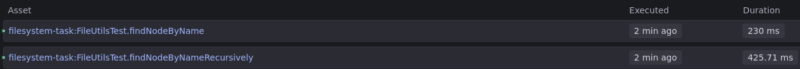

# Task for knowledge of the Java collections

## Description

Search pre-constructed in-memory filesystem for nodes by name.

1. Create a class model that should consist of such nodes:
   a) files that are having filenames
   b) folders containing files and another folders
2. Create some sample object structure of your in-memory filesystem
3. Search and print in this "filesystem" for nodes by search criteria.

Return the List of absolute paths to the found nodes.

## Constraints

1. The search should be case-insensitive and be able to find nodes by a full name
2. Assume that all filenames and folder names are unique on the same level of the filesystem
3. Assume that the filesystem is not cyclic
4. Assume that the names of the files and folders are not empty and not null and consist of letters
   and digits only
5. Absolute path should consist of the names of the folders and files separated by the slash symbol
   ("/")


## Implementation
For the first implementation, the profiler results are as follows:
```
```
